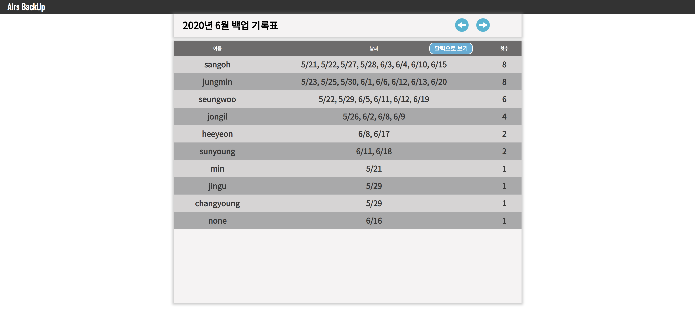
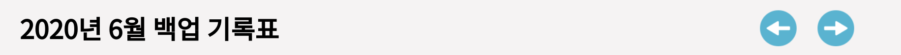
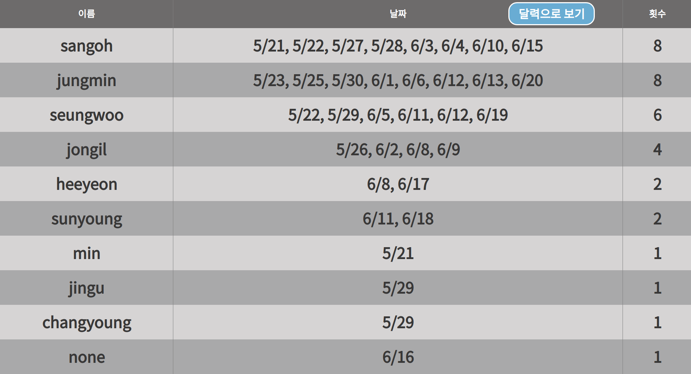
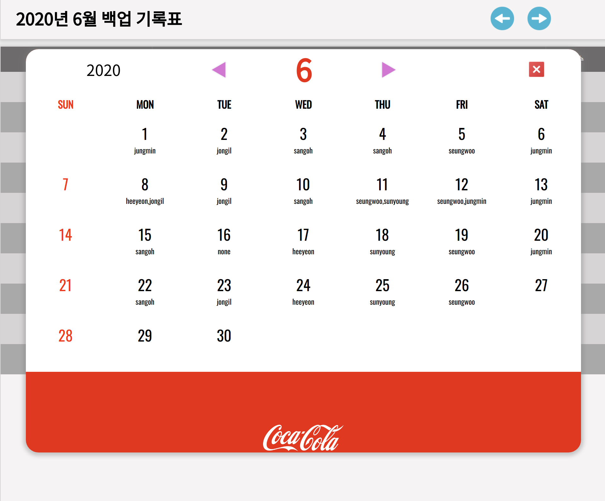

# **AIRS Backup Page**

## React Menual
This project was bootstrapped with [Create React App](https://github.com/facebook/create-react-app).

## Available Scripts

In the project directory, you can run:

### `yarn start`

Runs the app in the development mode. 
Open [http://localhost:3000](http://localhost:3000) to view it in the browser.

The page will reload if you make edits. 
You will also see any lint errors in the console.

### `yarn test`

Launches the test runner in the interactive watch mode. 
See the section about [running tests](https://facebook.github.io/create-react-app/docs/running-tests) for more information.

### `yarn build`

Builds the app for production to the `build` folder. 
It correctly bundles React in production mode and optimizes the build for the best performance.

The build is minified and the filenames include the hashes. 
Your app is ready to be deployed!

See the section about [deployment](https://facebook.github.io/create-react-app/docs/deployment) for more information.

### `yarn eject`

**Note: this is a one-way operation. Once you `eject`, you can’t go back!**

If you aren’t satisfied with the build tool and configuration choices, you can `eject` at any time. This command will remove the single build dependency from your project.

Instead, it will copy all the configuration files and the transitive dependencies (webpack, Babel, ESLint, etc) right into your project so you have full control over them. All of the commands except `eject` will still work, but they will point to the copied scripts so you can tweak them. At this point you’re on your own.

You don’t have to ever use `eject`. The curated feature set is suitable for small and middle deployments, and you shouldn’t feel obligated to use this feature. However we understand that this tool wouldn’t be useful if you couldn’t customize it when you are ready for it.

## Learn More

You can learn more in the [Create React App documentation](https://facebook.github.io/create-react-app/docs/getting-started).

To learn React, check out the [React documentation](https://reactjs.org/).
***

## __Menual__
>## #__접속 방법__
>>### 1. 일단 앞에 설명된 방법으로 __프로그램을 실행 시킨다__.
>>### 2. 그후 로컬에 접속하여 상태를 확인한다. (기본 포트는 https://localhost:3000 이다)
>> </img>
>>### __# 정상적으로 접속이 되었다면 이러한 페이지가 불러져 올 것이다.__
>>  
 

---
## __기능 설명__

>## __주요 기능__ : 데이터 백업을 갔다온 사람들이 파일 서버에 데이터를 업로드 하면 그 데이터 정보를 읽어와서 통계와 GUI로 손쉽게 한달 통계를 볼 수 있다.
>## **그외 기능** : **달력 GUI**로 빈틈 없이 한눈에 백업 상황을 확인이 가능하다. 자유롭게 원하는 년도의 해당 월 기록을 확인 할수도 있다.
>  
 

---
## __상세 기능__

## __1. 지난달 or 다음달 이동 버튼__
> ### </img>
> ### 위에 이미지에 보이듯이 오른쪽에 버튼을 클릭하면 지난달이나 다음 달의 통계 테이블로 이동 할 수 있다.
>  
 

## __2. 기록 테이블__
> ### </img>
> ###  위에 테이블 이미지 처럼 한달의 백업 정보들이 테이블에 기록이 된다. 또한 그냥 한달 기준이 아닌 월급 정산 기준인 전달 20일 이후 부터 다음달 20일까지의 기록들만 기록하는 시스템이다. 이렇게 하면 급여를 정산하시는 분이 날짜 계산하면서 보실 이유가 사라지는 것이다. 또한 가장 많이 갔다온 순서로 데이터를 정렬 시켜준다.  
>  
 

## __3. 달력 버튼__
> ### </img>
> ###  위에 있는 버튼을 클릭하면 해당 년 월의 백업 정보가 기록 된 GUI 달력이 출력이 된다.   
>  
 

## __4. 테이블 달력__
> ### </img>
> ###  위에서 설명 된 달력 버튼을 클릭하면 위에 이미지 처럼 해당 년월의 달력이 출력 된다. 보이는 것과 같이 해당 사람이 간 날짜에 이름이 표시 되면서 테이블을 보지 않아도 누가 언제 갔는지 안 갔는지 손쉽게 확인이 가능하다. 심지어 달력 내에서도 지난 달 또는 다음 달의 달력으로 이동이 가능하다. 우측 상단의 닫기 버튼을 누르면 달력은 사라진다.  
>  
 

---

# __#코드 리뷰__

## __유저들이 필요할 시 작성함__

---
### Develop by 정민, 이호 
---